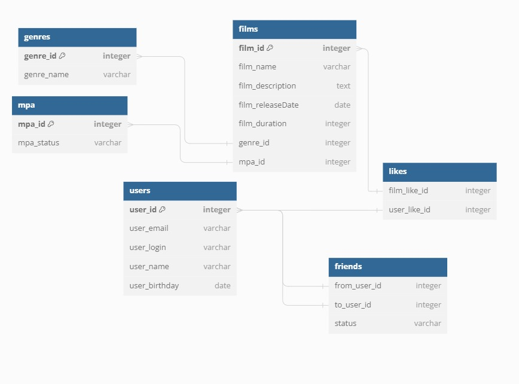

# Filmorate Database Schema



## Обзор

Эта схема базы данных разработана для приложения Filmorate. Она состоит из следующих таблиц:

- `films`: Содержит информацию о фильмах.
- `users`: Содержит информацию о пользователях.
- `friends`: Хранит информацию о дружеских отношениях между пользователями.
- `likes`: Хранит информацию о том, какие пользователи понравились какие фильмы.
- `genres`: Содержит информацию о жанрах фильмов.
- `mpa`: Содержит информацию о рейтингах MPA для фильмов.

## Пример запроса

### Выбираем имена пользователей и количество фильмов, которые они лайкнули

```sql
SELECT u.user_name, 
       COUNT(l.film_like_id) AS like_count
FROM likes AS l
INNER JOIN films AS f ON l.film_like_id = f.film_id
INNER JOIN users AS u ON l.user_like_id = u.user_id
GROUP BY u.user_name;